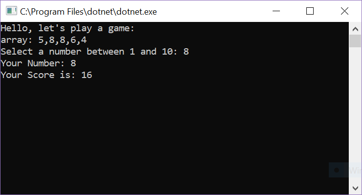
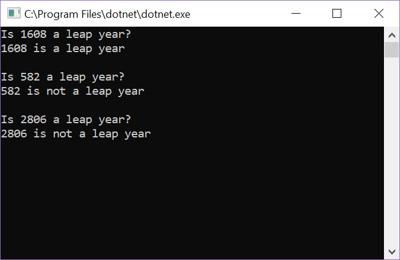

# Prework-CodeChallenges


## Problem 1: Array Max Result

#### Problem Statement
Given an array select a number that exists, and output the computated "score". The method you create should take in
both an array of integers and the integer the user selected.

Create a Console application that requests 5 numbers between 1-10. Output the array to the console and Ask the user to
select a number. After the selection, output the "score" of the number chosen.

#### Selection and Scoring Algorithm
You can select any number from the list, however your scoring will be depend on the frequency of that number in the list. 
E.g for [2,2,3,5,4] if you pick 2 your score will be 4 (2 * 2) but if you pick 5 your score will be 5 (5 * 1)

#### Input Format
An array of integers, and the number chosen.

#### Sample Input
[6,4,4,1,3] , 4

#### Sample Output
8


#### Screen Capture


## Problem 2: Leap Year Calculator

#### Problem Statement
Given a year, report if it is a leap year.

The tricky thing here is that a leap year in the Gregorian calendar occurs:

```
on every year that is evenly divisible by 4
  except every year that is evenly divisible by 100
    unless the year is also evenly divisible by 400

```

For example, 1997 is not a leap year, but 1996 is. 1900 is not a leap year, but 2000 is.

Want to know more about Leap Year? Watch this 4 minute video [HERE](https://www.youtube.com/watch?v=xX96xng7sAE)

Note: This is not a trick problem. Edge cases do not need to be taken into consideration when creating a solution.

#### Screen Capture

Note: I ran the code three times to show multipe outcomes, but the code only actually runs once.

## Problem 3: Perfect Sequence

#### Problem Statement
Given an array. Return "Yes" if the sequence is considered a perfect sequence. Otherwise, return "No"

#### Perfect Sequences
A perfect sequence is a sequence such that all of its elements are non-negative integers and the product of all of them is equal to their sum. 
For example: [2,2], [1,3,2] and [0,0,0,0] are perfect sequences and [4,5,6] and [0,2,-2] are not perfect sequences. Negative numbers of any kind are not valid in 
a perfect sequence

#### Input Format
An array of integers (may not be sorted)

#### Sample Input
[1,3,2]

#### Sample Output
Yes

#### Explanation
1 * 3 * 2 = 6 && 1 + 3 + 2 = 6